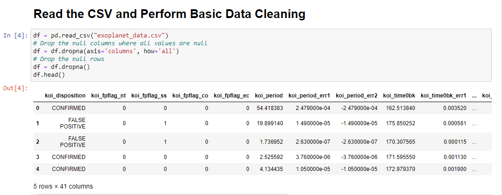
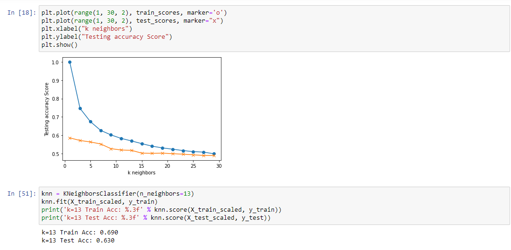
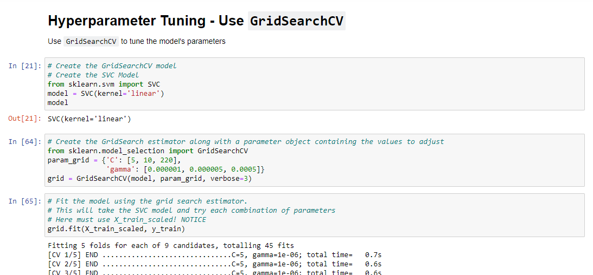
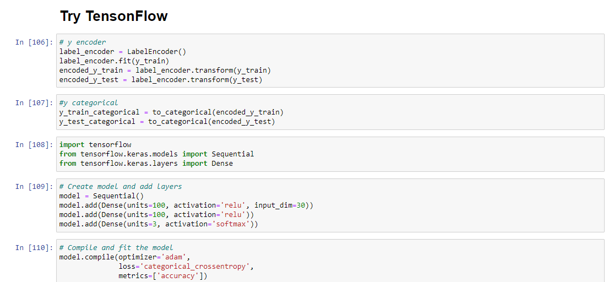

# Machine Learning - Exoplanet Exploration

Tony Zhao finished 16/05/21

## Background

Over a period of nine years in deep space, the NASA Kepler space telescope has been out on a planet-hunting mission to discover hidden planets outside of our solar system.

To help process this data, create machine learning models capable of classifying candidate exoplanets from the raw dataset.

- - -

## task procedures:

### Preprocess the Data

* Preprocess the dataset prior to fitting the model.
* 30 feature/columns selected and remove unnecessary features.
* "koi_fpflag_nt, koi_fpflag_ss, koi_fpflag_co,koi_fpflag_ec, koi_period, koi_period_err1,	    koi_period_err2, koi_time0bk, koi_time0bk_err1 have been removed.
* Use `MinMaxScaler` to scale the numerical data.
* Separate the data into training and testing data.

### Tune Model Parameters

* Use KNN to start the job.
  Result : k=13 Train Acc: 0.690, Test Acc: 0.630
  
  
* Use `GridSearch` to tune model parameters and the grid model saved as "tony.save".
  The best params {'C': 220, 'gamma': 1e-06} with the best score: 0.7192458830292754
  
  
* Tune and compare at least two different classifiers.
* Finally tensonflow has been tested.

    
   
   result Normal Neural Network - Loss: 0.5937785440778841, Accuracy: 0.7602974772453308 
   Predict is also made from the tesonflow mordel:
   Predicted classes: ['CANDIDATE' 'FALSE POSITIVE' 'CANDIDATE' 'CONFIRMED' 'CONFIRMED' CANDIDATE']
   Actual Labels: ['FALSE POSITIVE', 'CONFIRMED', 'CANDIDATE', 'CONFIRMED', 'CONFIRMED', 'CONFIRMED']

* I think tesonflow made a better model for the given data, because the Acc is higher. 

* My assumptions 1:the time/period related features are not much relevant so I have deleted them.
* My assumptions 2:the flag related features are not much relevant in my case, due to it related to        
  the observers' remarks, which have been deleted too. Hope I am right.

* Use `GridSearch` to tune model parameters.
* Tune and compare at least two different classifiers.

- - -

## Resources

* [Exoplanet Data Source](https://www.kaggle.com/nasa/kepler-exoplanet-search-results)

* [Scikit-Learn Tutorial Part 1](https://www.youtube.com/watch?v=4PXAztQtoTg)

* [Scikit-Learn Tutorial Part 2](https://www.youtube.com/watch?v=gK43gtGh49o&t=5858s)

* [Grid Search](https://scikit-learn.org/stable/modules/grid_search.html)

- - -
